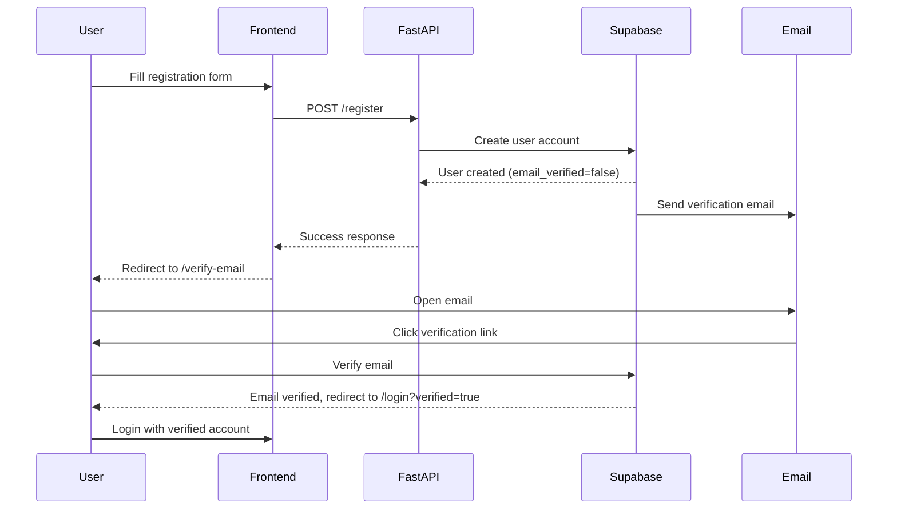

# TestGenius AI - System Architecture

## Table of Contents
1. [System Overview](#system-overview)
2. [Architecture Diagram](#architecture-diagram)
3. [Directory Structure](#directory-structure)
4. [Technology Stack](#technology-stack)
5. [Architecture Layers](#architecture-layers)
6. [Data Flow](#data-flow)
7. [Authentication Flow](#authentication-flow)
8. [Billing & Tier System](#billing--tier-system)
9. [AI Generation Pipeline](#ai-generation-pipeline)
10. [Component Relationships](#component-relationships)
11. [API Design](#api-design)
12. [Security Considerations](#security-considerations)

---

## System Overview

TestGenius AI is a FastAPI-based web application that generates practice test questions for Udemy courses using Claude AI. The system follows a modular, three-tier architecture pattern with clear separation between presentation, business logic, and data layers.

### Key Features
- AI-powered practice test generation
- Three-tier subscription model (Free, Pro, Business)
- Email verification system
- Stripe payment integration
- Bulk CSV export
- RESTful API with OpenAPI documentation

---

## Architecture Diagram

```
┌─────────────────────────────────────────────────────────────────┐
│                         FRONTEND LAYER                          │
│  ┌──────────────┐  ┌──────────────┐  ┌──────────────┐         │
│  │   Landing    │  │     Auth     │  │   App/Pro    │         │
│  │    Pages     │  │    Pages     │  │    Pages     │         │
│  └──────┬───────┘  └──────┬───────┘  └──────┬───────┘         │
│         │                  │                  │                  │
│         └──────────────────┴──────────────────┘                  │
│                            │                                     │
│                    ┌───────▼────────┐                           │
│                    │  JS Utilities  │                           │
│                    │  - API Client  │                           │
│                    │  - Auth Helper │                           │
│                    │  - UI Helpers  │                           │
│                    └───────┬────────┘                           │
└────────────────────────────┼──────────────────────────────────────┘
                             │ HTTP/REST
┌────────────────────────────┼──────────────────────────────────────┐
│                    BACKEND LAYER (FastAPI)                        │
│                    ┌───────▼────────┐                           │
│                    │   main.py      │                           │
│                    │  (FastAPI App) │                           │
│                    └───────┬────────┘                           │
│                            │                                     │
│         ┌──────────────────┼──────────────────┐                 │
│         │                  │                  │                 │
│    ┌────▼─────┐    ┌──────▼──────┐    ┌─────▼──────┐          │
│    │   Auth   │    │   Billing   │    │ Generator  │          │
│    │  Router  │    │   Router    │    │   Router   │          │
│    └────┬─────┘    └──────┬──────┘    └─────┬──────┘          │
│         │                  │                  │                 │
│    ┌────▼─────┐    ┌──────▼──────┐    ┌─────▼──────┐          │
│    │   Auth   │    │   Billing   │    │ Generator  │          │
│    │ Services │    │  Services   │    │  Services  │          │
│    └────┬─────┘    └──────┬──────┘    └─────┬──────┘          │
│         │                  │                  │                 │
│         └──────────────────┴──────────────────┘                 │
│                            │                                     │
│                    ┌───────▼────────┐                           │
│                    │  Shared Utils  │                           │
│                    │  - Config      │                           │
│                    │  - Logging     │                           │
│                    │  - Exceptions  │                           │
│                    └───────┬────────┘                           │
└────────────────────────────┼──────────────────────────────────────┘
                             │
┌────────────────────────────┼──────────────────────────────────────┐
│                    EXTERNAL SERVICES                              │
│         ┌──────────────────┼──────────────────┐                 │
│         │                  │                  │                 │
│    ┌────▼─────┐    ┌──────▼──────┐    ┌─────▼──────┐          │
│    │ Supabase │    │   Stripe    │    │ Claude AI  │          │
│    │   Auth   │    │   Billing   │    │   API      │          │
│    │   & DB   │    │             │    │            │          │
│    └──────────┘    └─────────────┘    └────────────┘          │
└─────────────────────────────────────────────────────────────────┘
```

---

## Directory Structure

```
udemy-practice-test-maker/
├── auth/                          # Authentication module
│   ├── __init__.py
│   ├── routes.py                  # Auth endpoints (/register, /login, /usage)
│   └── services.py                # Auth business logic (Supabase integration)
│
├── billing/                       # Billing & subscription module
│   ├── __init__.py
│   ├── routes.py                  # Billing endpoints (/subscribe, /webhook)
│   └── services.py                # Stripe integration, tier management
│
├── generator/                     # AI test generation module
│   ├── __init__.py
│   ├── routes.py                  # Generator endpoints (/generate)
│   └── services.py                # Claude AI integration, CSV generation
│
├── utils/                         # Shared utilities
│   ├── __init__.py
│   ├── logging_config.py          # Structured logging setup
│   └── exceptions.py              # Custom exception classes
│
├── static/                        # Static assets
│   ├── css/
│   │   └── udemy-theme.css        # Udemy-inspired design system
│   └── js/
│       ├── pages/                 # Page-specific JavaScript
│       │   ├── app.js             # Test generator app logic
│       │   ├── pro.js             # Pricing page logic
│       │   ├── landing.js         # Homepage interactivity
│       │   ├── login.js           # Login form handling
│       │   ├── register.js        # Registration form handling
│       │   └── verify-email.js    # Email verification handling
│       └── utils/                 # Reusable JavaScript utilities
│           ├── api-client.js      # Centralized API client
│           ├── auth.js            # Auth state management
│           └── helpers.js         # UI utility functions
│
├── templates/                     # Jinja2 HTML templates
│   ├── components/                # Reusable HTML components
│   │   ├── nav_landing.html       # Marketing page nav
│   │   ├── nav_app.html           # App page nav
│   │   ├── nav_auth.html          # Auth page nav
│   │   ├── footer.html            # Footer component
│   │   └── js_utils.html          # Utility scripts loader
│   ├── index.html                 # Landing page
│   ├── app.html                   # Test generator application
│   ├── pro.html                   # Pricing & plans page
│   ├── login.html                 # Login page
│   ├── register.html              # Registration page
│   └── verify-email.html          # Email verification page
│
├── main.py                        # FastAPI application entry point
├── config.py                      # Configuration & constants
├── requirements.txt               # Python dependencies
├── .env                           # Environment variables (not in git)
├── .env.example                   # Environment template
│
└── Documentation
    ├── README.md                  # Project overview
    ├── QUICKSTART.md              # Quick setup guide
    ├── DEPLOYMENT_GUIDE.md        # Deployment instructions
    ├── ARCHITECTURE.md            # This file
    ├── THEME_README.md            # Design system guide
    └── UDEMY_DESIGN_SYSTEM.md     # Udemy theme specifications
```

---

## Technology Stack

### Backend
- **FastAPI** - Modern Python web framework with automatic OpenAPI docs
- **Python 3.8+** - Core language
- **Anthropic Claude AI** - AI-powered question generation
- **Supabase** - Backend-as-a-Service (Auth + PostgreSQL database)
- **Stripe** - Payment processing

### Frontend
- **Vanilla JavaScript** - No framework dependencies
- **Jinja2** - Server-side HTML templating
- **Custom CSS** - Udemy-inspired design system
- **Fetch API** - HTTP client for API calls

### Development & Deployment
- **Uvicorn** - ASGI server
- **Git** - Version control
- **Environment Variables** - Configuration management

---

## Architecture Layers

### 1. Presentation Layer (Frontend)

**Location**: `templates/` and `static/js/`

**Responsibilities**:
- Render HTML pages via Jinja2 templates
- Handle user interactions
- Make API calls via centralized API client
- Manage client-side state (auth tokens, form state)
- Display feedback (loading states, errors, success messages)

**Key Components**:
- **Templates**: Server-rendered HTML with reusable components
- **JavaScript Utilities**: Centralized modules for API calls, auth, UI helpers
- **Page Scripts**: Page-specific business logic

### 2. Application Layer (Backend)

**Location**: `main.py`, `auth/`, `billing/`, `generator/`

**Responsibilities**:
- Route HTTP requests to appropriate handlers
- Implement business logic
- Validate input data
- Integrate with external services (Supabase, Stripe, Claude AI)
- Handle errors and return appropriate responses
- Enforce authentication and authorization

**Key Components**:
- **Routers**: Define API endpoints and route requests
- **Services**: Contain business logic and external integrations
- **Middleware**: CORS, error handling, logging

### 3. Data Layer

**Location**: External (Supabase PostgreSQL)

**Responsibilities**:
- Store user accounts
- Track subscription tiers
- Record usage metrics (questions generated per month)
- Manage email verification status

**Key Tables** (Supabase):
- `users` - User accounts, email verification, tier
- `subscriptions` - Stripe subscription data
- `usage` - Monthly question generation tracking

---

## Data Flow

### 1. Page Load Flow

```
User Browser
    │
    ├─► GET / (Landing page)
    │       │
    │       └─► FastAPI serves templates/index.html
    │               │
    │               └─► Browser loads /static/js/pages/landing.js
    │
    ├─► GET /app (Application page)
    │       │
    │       ├─► Check if authenticated (Auth.requireAuth())
    │       │       │
    │       │       └─► If not, redirect to /login
    │       │
    │       ├─► FastAPI serves templates/app.html
    │       │
    │       └─► Browser loads /static/js/pages/app.js
    │               │
    │               └─► Calls api.get('/usage') to load user data
    │
    └─► GET /login
            │
            └─► FastAPI serves templates/login.html
```

### 2. Authentication Flow

```
Registration:
User fills form → POST /register → auth/routes.py
    │
    ├─► Validate input (username, email, password)
    │
    ├─► auth/services.py → Supabase.auth.signUp()
    │
    ├─► Send verification email
    │
    └─► Redirect to /verify-email

Login:
User fills form → POST /login → auth/routes.py
    │
    ├─► Validate credentials
    │
    ├─► auth/services.py → Supabase.auth.signIn()
    │
    ├─► Check email_verified status
    │
    ├─► Return JWT token
    │
    └─► Frontend stores token → Redirect to /app
```

### 3. Test Generation Flow

```
User submits form → POST /generate → generator/routes.py
    │
    ├─► Extract JWT token from Authorization header
    │
    ├─► Verify authentication (get_current_user)
    │
    ├─► Validate request data:
    │   - num_questions (1-50)
    │   - learning_objectives (4-10)
    │   - difficulty, course_category, etc.
    │
    ├─► Check usage limits:
    │   - Free: 20/month
    │   - Pro: 2,500/month
    │   - Business: 7,500/month
    │
    ├─► If limit reached → Return 429 error
    │
    ├─► generator/services.py:
    │   ├─► Build AI prompt from course data
    │   ├─► Call Claude AI API
    │   ├─► Parse JSON response
    │   └─► Generate CSV in Udemy format
    │
    ├─► Update user usage counter in database
    │
    └─► Return CSV file for download
```

### 4. Upgrade/Subscription Flow

```
User clicks upgrade → POST /subscribe → billing/routes.py
    │
    ├─► Verify authentication
    │
    ├─► billing/services.py:
    │   ├─► Create Stripe Checkout Session
    │   │   - price_id (pro or business)
    │   │   - customer_email
    │   │   - success_url, cancel_url
    │   │
    │   └─► Return checkout URL
    │
    └─► Redirect user to Stripe Checkout

Stripe Webhook:
Stripe sends event → POST /webhook → billing/routes.py
    │
    ├─► Verify webhook signature
    │
    ├─► Handle event:
    │   - checkout.session.completed → Upgrade tier
    │   - customer.subscription.updated → Update tier
    │   - customer.subscription.deleted → Downgrade to free
    │
    └─► Update user tier in Supabase database
```

---

## Authentication Flow

### Registration & Email Verification



### JWT Token Flow

1. **Login**: User provides credentials → Backend validates → Returns JWT token
2. **Storage**: Frontend stores token in `localStorage`
3. **API Calls**: Frontend includes token in `Authorization: Bearer <token>` header
4. **Validation**: Backend validates token on each protected endpoint
5. **Auto-redirect**: If token invalid (401), frontend auto-redirects to /login
6. **Logout**: Frontend removes token and redirects to homepage

**Token Location**: `static/js/utils/auth.js` and `static/js/utils/api-client.js`

---

## Billing & Tier System

### Tier Configuration

Defined in `config.py`:

```python
TIER_LIMITS = {
    "free": {
        "questions_per_month": 20,
        "price_monthly": 0
    },
    "pro": {
        "questions_per_month": 2500,
        "price_monthly": 9
    },
    "business": {
        "questions_per_month": 7500,
        "price_monthly": 19
    }
}
```

### Usage Tracking

- **Counter**: `monthly_chars_used` field in user record
- **Reset**: Monthly reset via scheduled job (implementation pending)
- **Enforcement**: Checked before each generation request
- **Display**: Shown in app UI via `/usage` endpoint

### Stripe Integration

**Checkout Flow**:
1. User clicks "Upgrade" button
2. Frontend calls `POST /subscribe` with tier
3. Backend creates Stripe Checkout Session
4. User redirected to Stripe payment page
5. After payment, Stripe redirects back with success/cancel

**Webhook Handling**:
- Endpoint: `POST /webhook`
- Events handled:
  - `checkout.session.completed` - Activate subscription
  - `customer.subscription.updated` - Update tier
  - `customer.subscription.deleted` - Downgrade to free
- Security: Webhook signature verification

---

## AI Generation Pipeline

### Flow Diagram

```
User Input → Validation → Prompt Building → Claude AI → Parsing → CSV Export
```

### Detailed Steps

**1. Input Validation** (`generator/routes.py`)
- Number of questions: 1-50
- Learning objectives: 4-10 items, max 160 chars each
- Difficulty: beginner/intermediate/advanced
- Course category: from predefined list

**2. Prompt Construction** (`generator/services.py`)
- Template-based prompt generation
- Includes all course metadata
- Specifies JSON output format
- Defines question structure (single/multiple choice)

**3. Claude AI Call**
```python
client.messages.create(
    model="claude-3-5-sonnet-20241022",
    max_tokens=16000,
    temperature=0.7,
    messages=[{"role": "user", "content": prompt}]
)
```

**4. Response Parsing**
- Extract JSON from Claude's response
- Validate structure (questions, answers, explanations)
- Handle malformed responses

**5. CSV Generation**
- Convert JSON to Udemy CSV format
- Headers: Question, Question Type, Answer Option 1-6, Explanation 1-6, Correct Answers, Overall Explanation, Domain
- Sanitize text (escape quotes, newlines)
- Generate filename: `{course_title}_practice_test.csv`

**6. Usage Update**
- Increment `monthly_chars_used` counter
- Return CSV file to frontend

---

## Component Relationships

### Frontend Component Hierarchy

```
index.html (Landing)
├── components/nav_landing.html
├── components/footer.html
├── js/pages/landing.js
└── js/utils/*

app.html (Generator)
├── components/nav_app.html
├── components/js_utils.html
│   ├── js/utils/api-client.js
│   ├── js/utils/auth.js
│   └── js/utils/helpers.js
└── js/pages/app.js

login.html / register.html
├── components/nav_auth.html
├── js/utils/api-client.js
└── js/pages/{login|register}.js
```

### Backend Module Dependencies

```
main.py
├── config.py
├── auth/routes.py
│   ├── auth/services.py (Supabase client)
│   ├── utils/logging_config.py
│   └── utils/exceptions.py
├── billing/routes.py
│   ├── billing/services.py (Stripe client)
│   ├── utils/logging_config.py
│   └── utils/exceptions.py
└── generator/routes.py
    ├── generator/services.py (Claude AI client)
    ├── config.py (tier limits, validation)
    ├── utils/logging_config.py
    └── utils/exceptions.py
```

### External Service Integration Points

```
auth/services.py → Supabase Auth API
    - signUp()
    - signIn()
    - getUser()

billing/services.py → Stripe API
    - checkout.sessions.create()
    - webhooks.constructEvent()

generator/services.py → Anthropic Claude API
    - messages.create()
```

---

## API Design

### Endpoint Structure

```
Authentication:
POST   /register              Create new user account
POST   /login                 Authenticate user, get JWT token
GET    /usage                 Get current user tier and usage stats

Billing:
POST   /subscribe             Create Stripe checkout session
POST   /webhook               Handle Stripe webhook events

Generator:
POST   /generate              Generate practice test questions

Pages (HTML):
GET    /                      Landing page
GET    /app                   Test generator application
GET    /pro                   Pricing & plans
GET    /login                 Login form
GET    /register              Registration form
GET    /verify-email          Email verification instructions

System:
GET    /health                Health check endpoint
GET    /api/docs              Swagger UI (OpenAPI)
GET    /api/redoc             ReDoc UI (OpenAPI)
```

### Request/Response Examples

**POST /generate**
```json
Request:
{
  "num_questions": 10,
  "working_title": "AWS Solutions Architect",
  "learning_objectives": [
    "Design scalable systems",
    "Implement security best practices",
    "Optimize costs",
    "Deploy multi-region architectures"
  ],
  "target_audience": "IT professionals preparing for AWS certification",
  "difficulty": "intermediate",
  "course_category": "IT & Software"
}

Response:
Headers: Content-Disposition: attachment; filename="aws_solutions_architect_practice_test.csv"
Body: CSV file content
```

**GET /usage**
```json
Response:
{
  "username": "johndoe",
  "email": "john@example.com",
  "tier": "pro",
  "monthly_limit": 2500,
  "questions_used": 150,
  "questions_remaining": 2350,
  "email_verified": true
}
```

---

## Security Considerations

### Authentication Security
- **JWT Tokens**: Secure token-based authentication
- **Email Verification**: Required before full account access
- **Password Hashing**: Handled by Supabase (bcrypt)
- **Token Storage**: localStorage (XSS considerations apply)

### API Security
- **CORS**: Configured for specific origins
- **Authorization**: JWT validation on protected endpoints
- **Rate Limiting**: Usage limits per tier
- **Input Validation**: Server-side validation on all inputs

### Payment Security
- **Stripe Integration**: PCI-compliant payment processing
- **Webhook Verification**: Signature validation on Stripe events
- **No Card Storage**: All payment data handled by Stripe

### Data Security
- **Environment Variables**: Sensitive keys in .env (not in git)
- **HTTPS**: Required for production (Stripe requirement)
- **SQL Injection**: Prevented by Supabase ORM
- **XSS Prevention**: Input sanitization, CSP headers (recommended)

### Recommended Improvements
1. Implement CSRF tokens for form submissions
2. Add rate limiting middleware (e.g., slowapi)
3. Set Content-Security-Policy headers
4. Implement session timeout
5. Add 2FA option for high-value accounts
6. Regular security audits of dependencies

---

## Scalability Considerations

### Current Limitations
- **Single Server**: No horizontal scaling
- **Synchronous Processing**: API calls block during generation
- **No Caching**: Repeated requests regenerate content

### Future Improvements
1. **Async Processing**: Queue-based generation with job status tracking
2. **Caching**: Redis for user sessions and frequent queries
3. **CDN**: Serve static assets via CDN
4. **Database Optimization**: Connection pooling, read replicas
5. **Load Balancing**: Multiple app instances behind load balancer
6. **Monitoring**: Application performance monitoring (APM)

---

## Development Workflow

### Local Setup
1. Clone repository
2. Create `.env` from `.env.example`
3. Install dependencies: `pip install -r requirements.txt`
4. Run: `uvicorn main:app --reload`
5. Access: http://localhost:8000

### Code Organization Principles
- **Separation of Concerns**: Routes, services, utilities separated
- **DRY**: Shared utilities in `config.py`, `utils/`
- **Modularity**: Feature-based modules (auth, billing, generator)
- **Configuration**: Centralized in `config.py`
- **Logging**: Structured logging throughout

### Testing Strategy (To Be Implemented)
- Unit tests for services
- Integration tests for API endpoints
- End-to-end tests for critical flows
- Load testing for generation endpoint

---

## Deployment Architecture

See `DEPLOYMENT_GUIDE.md` for detailed deployment instructions.

**Production Stack**:
- **Hosting**: Railway, Heroku, or DigitalOcean App Platform
- **Database**: Supabase PostgreSQL (managed)
- **Monitoring**: Application logs, error tracking
- **CI/CD**: GitHub Actions (recommended)

---

**Last Updated**: November 30, 2024
**Version**: 1.0
**Maintained By**: TestGenius AI Development Team
